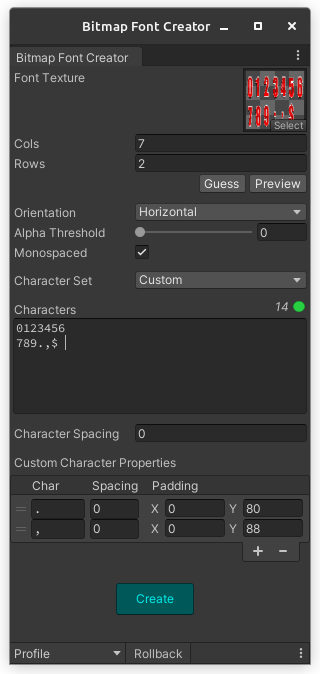

# Unity Bitmap Font Creator

A simple tool to create bitmap fonts from a texture sprite sheet to be used with Text component.

## How to use it
Select a texture, set the [options](#options) accondingly and hit _Create_. It will create a _Material_ and a _Font Settings_ asset with the same name as the texture and in the same folder.

Make sure your texture has the _Read/Write_ enabled inside its properties.

Because of some [limitation](#limitations), it'll not set the _Line Spacing_ field. If you need support to multi-line text, set it on the generated Font Settings file.

## Options

- **Texture**: Texture used for the font.
- **Orientation**: Order to look up for characters in the texture. Values: horizontal, vertical.
- **Cols**: Number of columns in the texture.
- **Rows**: Number of rows in the texture.
- **Alpha Threshold**: Alpha threshold to identify characters bounds.
- **Monospaced**: Whether the result font should be monospaced.
- **Character Set**: Predefined character set to use.
- **Characters**: Characters used in the font in order they appear in the texture. Use the space character to represent blank spaces in the texture.
- **Default Character Spacing**: Default spacing between characters.
- **Custom Character Properties**: Custom properties for each characters, if any. For now the only custom property is the spacing.
- **Profile**: Manage profiles. You can select, create, edit or delete profiles. Same as layout profiles in Unity.

## Limitations

This tool makes the most of the work to create a bitmap font to be used with the Text component but it has some limitations:
- **It works only with font sprite sheets not sprite atlases**. It means that the distance between characters in the texture are the same and there is a fixed value of rows and columns. In other words, it has to be a grid of characters. They can't be sparsed.
- **It can't set the line specing property**. For some reason, Unity doesn't allow us to edit the _line spacing_ field by code. You need to set it manually after running the tool.
