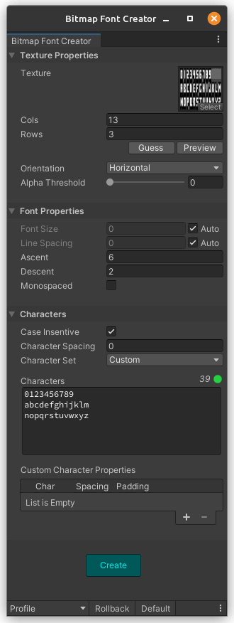
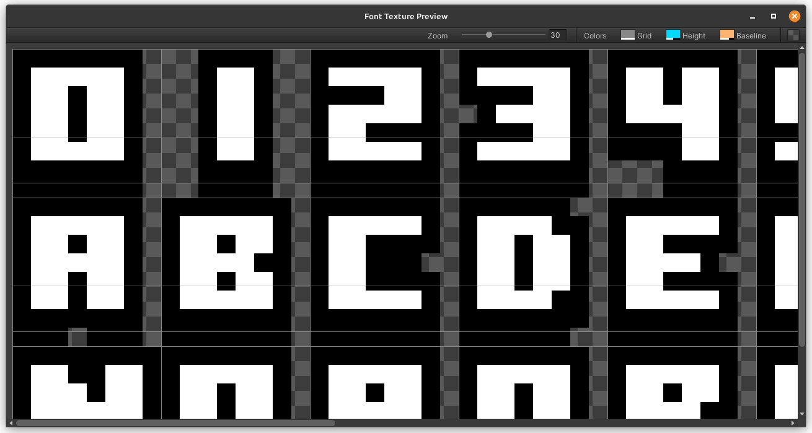

# Unity Bitmap Font Creator

A simple tool to create bitmap fonts from a texture sprite sheet to be used with Text component.

## How to use it

Select a texture, change the [settings](#settings) accondingly and hit _Create_. It will create a _Material_ and a _Font Settings_ asset with the same name as the texture and in the same folder.

Make sure your texture has the _Read/Write_ enabled inside its properties.

## Settings

Settings can be saved to [profiles](#profiles) and retrieved to be used later.

-  **Texture**: Texture used for the font. This is not saved to the profile.
-  **Cols**: Number of columns in the texture.
-  **Rows**: Number of rows in the texture.
-  **Orientation**: Order to look up for characters in the texture. Values: horizontal, vertical.
-  **Alpha Threshold**: Alpha threshold to identify characters bounds.
-  **Monospaced**: Whether the result font should be monospaced.
-  **Ascent**: Font ascent. It's the part of the glyphs that should be above the baseline.
-  **Descent**: Font descent. It's the part of the glyphs that should be below the baseline.
-  **Line Spacing**: Vertical spacing between lines.
-  **Character Set**: Predefined character set to use. This is not saved to the profile.
-  **Characters**: Characters used in the font in order they appear in the texture. Use the space character to represent blank spaces in the texture. You can break lines as much as you need to make it easier to add the character according to the texture.
-  **Default Character Spacing**: Default spacing between characters.
-  **Custom Character Properties**: Custom properties for each characters, if any.
   -  **Char**: Character to apply the properties.
   -  **Spacing**: Horizontal spacing after the character (advance). Ignored if font is monospaced.
   -  **Padding**: Custom horizontal and vertical padding to add before the character.

## Preferences

Preferences are saved in the editor using _EditorPrefs_.

-  **Warn before overwrite**: Warn before overwriting an existing font. This will replace the old font keeping the references.
-  **Warn before replacing settings**: Warn before replacing settings when selecting a profile.
-  **Warn before replacing profile**: Warn before replacing an existing profile.

## Actions

-  **Preview**: Preview the texture with current rows, columns, ascent and descent properties. 
   -  **Grid**: Color for the grid lines showing rows and columns.
   -  **Height**: Color for de glyph hight line (ascent + descent).
   -  **Baseline**: Color for the baseline (descent).
   -  **Background**: Choose between dark and light background patterns.
-  **Guess (Rows and Cols)**: Guess the number of rows and columns of the texture based on transparency gaps.
-  **Guess (Line Spacing)**: Guess Line Spacing based on the texture and the number of rows.
-  **Create**: Creates the font using the given settings.
-  **Rollback**: Rollback settings to the selected profile or default if none is selected.

## Measures

The plugin uses a simplified version of font measures. Here is a scheme of how they are used:

## Profiles

You can save profiles to retrieve them later, making easy to create patterns depending on the type of texture or font you are creating.

Profiles are saved to the each project inside the folder _Assets/Editor/Resources_.

All [settings](#settings) except for the _Texture_ and the _Character Set_ can be saved to the profile.

You can manage profiles by opening the _Profiles_ menu at the bottom left corner of the popup. Select, create, edit or delete profiles like you do with layout profiles in Unity.

## Known Issues

-  **It works only with font sprite sheets not sprite atlases**: It means that the distance between characters in the texture are the same and there is a fixed value of rows and columns. In other words, it has to be a grid of characters. They can't be sparsed.
-  **The resultant font works only with Legacy Text Component**: It doens't work with TextMeshPro texts.
